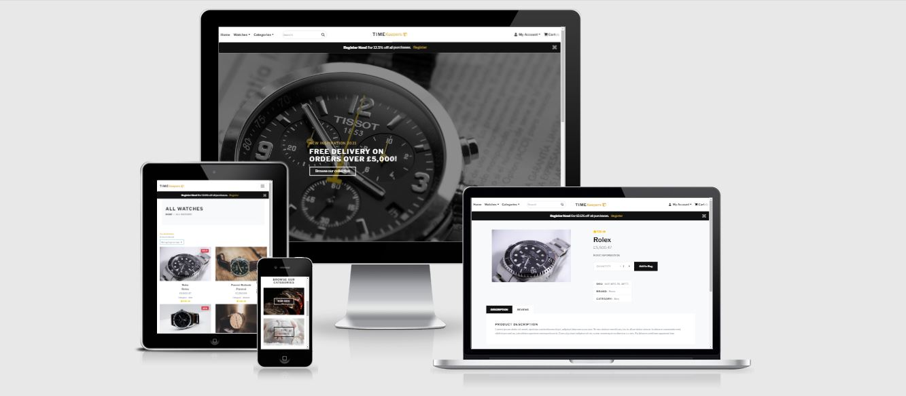

There are so many brands of watches and so many to choose from all with their individual websites. Wouldn’t it be so much easier if they were all on the same site? Where Rolex and Omega could be compared on more than just price but product description? Well know there is and it’s called TimeKeepers.

TimeKeepers is a multipage E-Commerce store where users can search, find out information and purchase authentic branded watches online as well as having the option of registering an account. This application is aimed at both men and women looking for a new watch by providing them with incentives such as member discount, delivery discount and the option of reading and leaving reviews on current watches available. 

Users have the option of registering an receiving a 12.5% discount off all items and a free delivery charge is offered to both registered and non-registered members for orders over £5,000. Registered users also have access to the TimeKeepers blog where they can like and comment on recent articles uploaded by the TimeKeepers franchise. We believe watches are far more than just a device for telling the time, but as a true reflection of oneself. Therefore, watch shopping is not just an experience but a journey to be enjoyed.

- [View Live Project](https://eljefe111944-timekeepers.herokuapp.com/)

- [View GitHub Repository](https://github.com/ElJefe111944/Milestone-4)

## Table of Contents
* [UX](#ux)
* [User Stories](#user-stories)
* [Design](#design)
* [Wireframes](#wireframes)
* [Features](#features)
* [Technologies Used](#technologies-used)
* [Testing](#testing)
* [Deployment](#deployment)
* [Credits](#credits)

## UX 
The main purpose of this site is to provide an easy to use but informative online experience while sharing our passion for the world of authentic branded watches. On this site the user can compare with other brands without having to go on that individual watchmaker’s website. Making the user experience far more efficient, secure and effective. The website is aimed at all those interested in the most famous brands of watches.

Below are the 5 core Business Objective on which this site was created:

-	To become the main online store of World-famous Brands.

-	To create a site that contains detailed information on the watches available showing our devoted interest in all the current brands available.

-	To provide the customer with the opportunity to leave a feedback in the form of a review of the watch earning customer trust and enhancing reputation.

-	To enable the user to give their opinions via comments in the blog section of the site. Thus, creating a community of Watch enthusiast.

-	To create an online store where the user feels safe and secure purchasing products online and entering personal key information

## User Stories:

The target audience is for all ages and cultures. However, there are three types of users for this site with distinct user stories.

A Guest User

-	As a guest user, I want to view all available watches without the need for registering.
-	As a guest user, upon entering the site, I want to know what the website is about and what content is available to me.
-	As a guest user, I want to read about or access information on a specific Watch.
-	As a guest user, I want to search for a watch by brand, category or name.
-	As a guest user, I want to access the site’s social media pages.
-	As a guest user, I want to search for a watch by typing key words into the search bar.
-	As a guest user, I want to be able to sort the available watches by price, rating, A-z and Z-A.
-	As a guest user, I to be able to add a watch the Shopping cart.
-	As a guest user, I want to be able to purchase a product safe and securely without registering.
-	As a guest user, I want receive a confirmation email after purchasing an item containing my order details.
-	As a guest user, I want to register and become a registered user.

 

A Registered User

-	As a registered user, I want to log in to my account and receive confirmation.
-	As a registered user I want to be able to add a review.
-	As a registered user I want to have access to the TimeKeepers Blog
-	As a registered user I want to be able to add a comment to an article in the Blog section.
-	As a registered user I want to be able to like/unlike an article in the blog section.
-	As a registered user, I want to receive a 12.5% discount on all items added to my shopping cart.
-	As a registered user I want to be able to store my information in a password protected profile.
-	As a registered user, I want to be able to receive confirmation when I have logged out of my account.
-	As a registered user, I want to create a profile upon registering.
-	As a registered user, I want to view the profile page and order history.
-	As a registered user, I want to edit the information on my profile page.
-	As a registered user, I want to be able to change my saved details.

 

An Admin User

-	As an admin user, I want to add a new Watch.
-	As an admin user, I want to update an existing Watch.
-	As an admin user, I want to delete an existing Watch.
-	As an admin user, I want to add a Blog.
-	As an admin user, I want to edit a Blog.
-	As an admin user, I want to delete a Blog.
-	As an admin user, I want to delete a comment.

 

## Design

The website design has been inspired by the bootstrap template below.

- [Bootstrap template](https://demo.bootstraptemple.com/e-commerce/index.html)

#### Colour Scheme

The main colours used in this site are #dcb14a, #6c757d, #fff, #000. 

These colours were chosen as they provide a nice modern look as well as an easy on the eye contrast to the other content on the page. A Landing images has been used on the home page with a transparent overlay and white text on the overlay fields. This is to hold the User’s attention as well as showcase the types of watches available. 

The watch details and blog details background colour are #6c757d making the background more calming and a text colour of #000 for clarity.

#### Typography

The site uses two different fonts on all pages. Both are from Google Fonts and have been used as follows:

-	Libre Franklin
-	Sans-serif

## Wireframes:

Below are the wireframes which represent the initial design for each page on both desktop and mobile views.

- [Base](static/wireframes/base.html-wireframe.pdf)
- [Home Page](static/wireframes/index.html-wireframe.pdf)
- [All Watches](static/wireframes/watches.html-wireframe.pdf)
- [Watch Details](static/wireframes/watch-details.html-wireframe.pdf)
- [Blogs](static/wireframes/blogs.html-wireframe.pdf)
- [Blog Article](static/wireframes/blog-details.html-wireframe.pdf)
- [Shopping Cart](static/wireframes/shoppingcart.html-wireframe.pdf)
- [Login](static/wireframes/login.html-wireframe.pdf)
- [Register](static/wireframes/register.html-wireframe.pdf)
- [My Profile](static/wireframes/myprofile.html-wireframe.pdf)
- [Checkout](static/wireframes/checkout.html-wireframe.pdf)
- [Add Review](static/wireframes/add_review.html-wireframe.pdf)

## Features 

The site contains certain features which are not available to all user. Depending on the type of user there are certain restrictions in place. An example of such features restricted are the CRUD operations for creating, updating and deleting watches and blogs. These have been restricted to the Admin user. Registered users are able to leave reviews, like blogs and leave comments. All other content is available for all users to view.

#### Existing features Visible to all Users:

Navigation Bar

-   Situated at the top of each page of the website the navigation links are represented as a burger icon on smaller media devices and standard navigation links on desktop screens. Enabling the user to access the pages most relevant to their needs with ease as well as providing an overview of the content available to the user on the other pages of the website. All the user has to do is to click on the links displayed in the navigation dropdown to browse the page of interest on the website. Certain links are restricted to registered users and can only be accessed once the user has registered and logged in. A Search bar situated in the centre of the navbar which provides the user upon entry to the site with the option of searching a specific watch name or brand.

Footer

-   At the bottom of each page of the website, the footer consists of social media icon links and a brief summary of the site. Here the user can access the site’s other social media accounts just by clicking on the different icons available. Also, the Timekeepers’s customer service documentation such as the Private Policy, Returns & Refunds, Disclaimer and Terms & Conditions can be downloaded.

Homepage

-   The landing/home page welcomes the user to the website and provides the user with a brief overview of the purpose of the site. This is for both those who have an idea what watch they are looking for and those who are looking for something new. There is also the prompt to register due to a 12.5% discount banner being displayed at the top of the homepage just under the navigation bar.

All Watches

-   This page contains a brief overview of each of the watches such as the name, brand price and rating with a responsive image of the watch. A link is situated at the bottom of each card labelled “more information” is where the user can find out more information on that particular watch. The user also has the ability to sort the watches by brands name, price, rating, A-Z, Z-A and for men or Women.

Watch Details

-   Available to all users upon selecting the “more information” button on one of the watch previews cards on the all-watches page. On this page the user is presented with a larger image of the watch, name and a product description. Registered users also have the option of leaving a review. An add to bag button is situated at the bottom of the page enabling the user to select the item for purchasing. There are also quantity selectors to provide the user with the option of selecting more than one item.

Login

-   Visible to all users as a navigation link and enables registered users to access their profiles once the required input fields have been completed in the correct format. An error message will be shown to the user if the fields do not match the required format. For non-registered users an error message will be shown if the details are not matched on the database instructing the user to register.

Register

-   Visible to all users as a navigation link and enables a new user to register and create a profile once the required input fields have been completed in the correct format with a registration confirmation message. An error message will be shown to the user if the fields do not match the required format. If the input data provided by the user already exists on the database then an error message will also be triggered to the user.

Shopping cart 

-   Visible to all users as a navigation link and enables the user to view the total number of items selected. Upon clicking the cart icon in the navigation bar, the user is directed to the shopping cart page. Here the user is provided with a brief summary of the items selected for purchasing. Key order information such as subtotal, member discount (if a registered user), delivery charge and total are displayed. The user is able to add or remove items from the shopping cart before proceeding to the checkout page.

Checkout 

-   Accessible to all users upon selecting the “proceed to checkout” button on the shopping cart page. On this page the user is presented with an order summary of the item(s), quantity and price. The fields labelled billing and shipping information need to be completed by the user and the payment is made via Stripe. Once the clicks “place order” a loading screen will appear then a payment successful page with the billing, order and shipping details. An error message will be shown to the user if the fields do not match the required format.

#### Existing features Visible to only registered users:

Blog

-   Only visible to registered users as a navigation link this page contains a brief overview of each of the Blogs such as the title, author and date published with a responsive image. Upon clicking on the title, the user can access the full blog article and find out more information on that particular topic. A list of recent blogs has also been provided to the user at the side of the page.

Blog Details

-   On this page the user is presented with the full article page. The users also have the option of leaving a comment or liking/unliking the article. A return button is situated at the bottom of the page enabling the user to return to the blogs page and view more blogs.

Profile page

-   Once a registered user the Profile page contain the registered user’s details along with order history (if applicable) which is specific to that individual user. Further information about the user can be added to this page by that specific user. All the existing input fields and input entries from the registration page are visible for updating such as contact details and shipping address.

#### Existing features Visible to site admin only:

Currently there are six different watches and Brands. As the site increases in popularity it may become necessary to add, update and delete the watches & blogs. Such operations are visible to the site admin to maintain the demand and expansion of the site. 

Add Watch

-   Only visible to admin users as a navigation dropdown link labelled “Add Watch”. Once the Admin user clicks on this button, they are redirected to the add watch page where they must add the name, image, description, price and rating in all the corresponding input fields. Once all inputs are completed in the required format then a confirmation message will be visible to the user with confirmation of the new watch being created. An error message will be shown to the user if the fields do not match the required format.

Update Watch

-   For each watch on the all-watches page and the watch details page. There is a button labelled “Edit Watch” visible only to the admin user. Once the Admin user clicks on this button, they are redirected to the update watch page where the existing input fields will be visible for editing. Once the input is completed in the required format a confirmation message will be visible to the user with confirmation of the updated category. An error message will be shown to the user if the fields do not match the required format.

Delete Watch

-   For each watch on the all-watches page and the watch details page. There is a button labelled “Delete Watch”. Once the Admin user clicks on this button a confirmation message will be visible to the user with confirmation the category has been deleted.

Add Blog

-   Only visible to admin users on the blogs page there is a button labelled “Add Blog”. Once the Admin user clicks on this button, they are redirected to the add blog page where they must add the name, image and article content in all the corresponding input fields. Once all inputs are completed in the required format then a confirmation message will be visible to the user with confirmation of the new watch being created. An error message will be shown to the user if the fields do not match the required format.

Update Blog

-   For each blog on the full blog details page. There is a button labelled “Update Watch” visible only to the admin user. Once the Admin user clicks on this button, they are redirected to the update blog page where the existing input fields will be visible for editing. Once the input is completed in the required format a confirmation message will be visible to the user with confirmation of the updated blog. An error message will be shown to the user if the fields do not match the required format.

Delete Blog

-   For each blog on the full blog details page. There is a button labelled “Delete blog”. Once the Admin user clicks on this button and confirms in the delete blog page a confirmation message will be visible to the user with confirmation the blog has been deleted.

Delete Comment 

-   For each blog on the full blog details page. There is a button for deleting user comments. Once the Admin user clicks on this button and confirms in the delete comment page a confirmation message will be visible to the user with confirmation the comment has been deleted.

### Django Apps:

The TimeKeepers site is made up of 6 Django applications. Each is a python package that provides a set of features. Such application may be reused or implemented in other projects the applications listed below were used in this project.

-	Homepage
-	Watches
-	Shoppingcart
-	Checkout
-	Profiles
-	Blog

### Features Left to Implement

The creation of this project has been a journey of many ups and down which I have thoroughly enjoyed. However, due to time constraints I have had to prioritise the implementation of certain features over other. Subsequently, have not been able to include all the features I wanted to when I started. Some features that may be implemented in the future are:

-	Pagination for the All Watches and All Users page.
-	A deleted section for the admin user. Therefore, all deleted items would need confirmation before deleting permanently.
-	The option for user to subscribe/unsubscribe to a newsletter which would be sent via email each month.
-	A discount coupon system which could be provided to certain users for a period of time to encourage purchases.
-	A suggested products section based of member’s recent searches.
-	Animations to enhance the user’s experience.
-	A contact page where the user can ask any direct questions to the site admin or TimeKeepers. This may help with additional queries with regards to a product.
-	A wish list where users could store a saved item and return to make the purchase at a later date.
-	The shopping cart maintains the selected item after the user has logged out. Currently the shopping cart refreshes upon the user signing out of their profile.
-	The author of a review is able to update or delete their review. Currently this is not an option purely due to time constraints.
-	Image size restriction on the upload image filed.

### Information Architecture

During development SQLite was used as Django uses SQL databases by default. For deployment PostgreSQL was used as provided by Heroku.

(DATA MODALS GO HERE)

## Technologies Used
### Languages:
- [HTML5](https://en.wikipedia.org/wiki/HTML5) 
  
  The project uses HTML (Hyper Text Mark-up Language) as this is the standard mark-up language for structuring and presenting the content on webpages.
- [CSS3](https://en.wikipedia.org/wiki/CSS) 

  The project uses CSS (Cascading Style Sheets) as this describes how the HTML elements should be displayed on the webpages.
- [JQuery](https://jquery.com/)

  A JavaScript library was used in this project to create and control the dynamic parts of the website such as the contact forms, Nav links and the collapsible features.

- [Javascript](https://www.javascript.com/) 
  
  JavaScript was used in this project to create and control the dynamic parts of the website such as thepreloader.

-  [Python](https://www.python.org/)
    
Used for backend data manipulation

-   [Django](https://www.djangoproject.com/) 

    
Python web framework for quick development.

-   [Jinja2 ](https://pypi.org/project/Jinja2/)

Used as the main language for template manipulation

### Integrated Development Environment:

- [Gitpod](https://gitpod.io/workspaces/) 

The website for this project was created using the online IDE Gitpod.

### Software Development Platform:

- [Github](https://github.com/) 

This project was saved in GitHub as a repository using GitHub’s hosting services

### Applications & Data storage:

-   [SQlite3](https://www.sqlite.org/index.html) 

Database used in development (Django’s default database)

-   [PostgreSQL](https://www.postgresql.org/) 

Database used for production through Heroku

- [Amazon S3](https://aws.amazon.com/s3/)

An object storage service. For storing data and images.

- [Heroku](https://www.heroku.com/)

A platform service that enables developers to build, run and operate applications entirely in the cloud.

### Frameworks:

-   [Bootstrap](https://www.bootstrapcdn.com/)
    
CSS framework used to assist with website responsiveness.

### Other Tools:

-   [Stripe](https://stripe.com/gb)

Online payment processing platform used in this project for test payments.

- [Google Fonts](https://fonts.google.com/)

The online library of licensed fonts was used in this project.

- [Font Awsome](https://fontawesome.com/)

The vast library of icons available from font awesome are used throughout this project to compliment texts and links making the design clearer and more concise.

- [Balsamiq](https://balsamiq.com/)

The industry standard wireframing tool was used at the start of this project to design and create a skeleton plan of each of the pages in this website on both desktop and mobile views.

### Validators:

- [HTML Validator](https://validator.w3.org/)
- [CSS Validator](https://jigsaw.w3.org/css-validator/)
- [Python Validator](http://pep8online.com/)
- [Javascript Validator](https://jshint.com/)
- [CSS Beautifier](https://www.cleancss.com/css-beautify/)

## Testing:

The following Web Development tools were used for this project for testing, debugging and optimising different variation of HTML, CSS and JavaScript. The Web Developer tools were also used to view the layout and structure of the website through different devices and to test the behaviour of the website on standard screen sizes to cover all media devices.

•	Chrome Developer Tools
•	DevTools (Firefox)
•	CSS Validator (Jigsaw)
•	HTML Validator (NU)
•	JavaScript Validator (Beautify Tools)

This website has been tested on the following devices: - Moto G4 - Galaxy S5 - Pixel 2 - iPhone 5/SE - iPhone 6/7/8 - iPhone 6/7/8 Plus - iPhone X - iPad - iPad Pro

### Testing User Stories

In this section, we will go over some of the user stories from the UX section and ensure that they all work as intended, with the project providing an easy and straightforward way for the users to achieve their goals.

Guest User

*As a guest user, I want to view all watches without the need for registering (Read Functionality).*

-	Click on the link to the "watches" page which is one of the links in the navigation bar. Please note, the link is in the navigation bar dropdown on mobile devices which can be activated by clicking on the burger icon at the top right-hand side of the page on smaller devices.

-	Scroll down the page to view the previews of all watches.

*As a guest user, I want to learn about or access the product description on a specific watch. (Read Functionality).*

-	Click on the link to the "Watches" page which is one of the links in the navigation bar

-	Scroll down the page to view the previews of all watches.

-	Click on the “More Information” link of the watch of interest to be viewed in more detail.

-	This process can be repeated in mobile views. Please note, the link is in the navigation bar dropdown which can be activated by clicking on the burger icon at the top right-hand side of the page

*As a guest user, I want to search for a watch by brand or name (Read Functionality).*

-	Go to the search bar in the centre of the Navigation bar available on all pages.

-*	Type the brand name or watch of interest and click the button labelled “Search”.

-	A list of watches relevant to the search input will be displayed.

*As a guest user, I wish to register and become a registered user (Create Functionality).*

-	Click on the link to the "Register" page which is one of the links in the navigation bar.

-	Complete the input fields and dropdowns in the required format.

-	If an error message saying “Username already exits” appears please try a different username.

-	Once all field have been completed and there are no error messages, click on the button labelled “Register” at the bottom of the form.

-	A verification email will be sent to the email address provided.

-	Once the email has been verified. A message will appear confirming the successful registration and the user will be redirected to the home page.

-	This process can be repeated in mobile views. Please note, the link is in the navigation bar dropdown which can be activated by clicking on the burger icon at the top right-hand side of the page

*As a guest user, I wish to add an item to my shopping cart (E-commerce Functionality).*

-	Click on the link to the "Watches" page which is one of the links in the navigation bar

-	Scroll down the page to view the previews of all watches.

-	Click on the “More Information” link of the watch of interest to be viewed in more detail.

-	Then Click on the “Add to bag” button adding the watch of interest to the shopping cart.

-	Once the item has been added a confirmation message will appear. Furthermore, the number of items in the cart icon in the navigation bar will update to reflect the current number of items selected by the user.

-	This process can be repeated in mobile views. Please note, the link is in the navigation bar dropdown which can be activated by clicking on the burger icon at the top right-hand side of the page

*As a guest user, I wish to update the number of items in my shopping cart (E-commerce Functionality).*

-	Click on the link to the "Cart" page which is one of the links in the navigation bar

-	Click on the one of the arrows in the column labelled “Quantity” to decrease or increase the number of items in the shopping cart.

-	Once the update has been selected click on the button labelled “Update”.

-	Once the item quantity has been updated a confirmation message will appear. Furthermore, the number of items in the cart icon in the navigation bar will update to reflect the current number of items selected by the user.

-	This process can be repeated in mobile views. Please note, the link is in the navigation bar dropdown which can be activated by clicking on the burger icon at the top right-hand side of the page

*As a guest user, I wish to remove an item from my shopping cart (E-commerce Functionality).*

-	Click on the link to the "Cart" page which is one of the links in the navigation 

-	Click on the one of the arrows in the column labelled “Quantity” to decrease or increase the number of items in the shopping cart.

-	Or, click on the bin icon situated on the right of the Total amount.

-   Once the item has been removed a confirmation message will appear and the user will be redirected to the shopping cart. Furthermore, the number of items in the cart icon in the navigation bar will update to reflect the current number of items selected by the user.

-	This process can be repeated in mobile views. Please note, the link is in the navigation bar dropdown which can be activated by clicking on the burger icon at the top right-hand side of the page.

*As a guest user, I wish to go to the checkout page and make a secure card payment and receive confirmation via email (E-commerce Functionality).*

-	Click on the link to the "Cart" page which is one of the links in the navigation bar

-	If the correct item and quantity have been selected, Click on the button labelled “Proceed to Checkout”.

-	Once all fields have been completed regarding billing address and there are no error messages, proceed to the payment details field.

-	In the payment input field enter the following:
    credit card: 4242 4242 4242 4242
    expiration date: 04 / 24
    CVC: 424
    ZIP: 42424

•	Once completed and there are no invalid inputs showing click on the button labelled “Place Order” and a loading screen will appear.

•	Once the payment has been successful a confirmation message will appear and the user will be redirected to the payment successful page. Here the order summary, billing address and total amounts are displayed.

•	An automated email with the order summary will also be sent to the email address provided in the checkout page. 

•	This process can be repeated in mobile views. Please note, the link is in the navigation bar dropdown which can be activated by clicking on the burger icon at the top right-hand side of the page.

Registered User:

*As a registered user, I wish to receive 12.5% discount off any item added to my shopping cart (E-commerce Functionality).*

-	Click on the link to the "Watches" page which is one of the links in the navigation bar

-	Scroll down the page to view the previews of all watches.

-	Click on the “More Information” link of the watch of interest to be viewed in more detail.

-	Then Click on the “Add to bag” button adding the watch of interest to the shopping cart.

-	Once the item has been added a confirmation message will appear. Furthermore, the number of items in the cart icon in the navigation bar will update to reflect the current number of items selected by the user.

-	Upon clicking on the shopping cart icon, the summary totals along with the discount and reduced price should be displayed before proceeding to the checkout.

-	This process can be repeated in mobile views. Please note, the link is in the navigation bar dropdown which can be activated by clicking on the burger icon at the top right-hand side of the page

*As a registered user I want to be able to add review to a watch I have recently purchased (Create functionality).*

-	Click on the link to the "Watches" page which is one of the links in the navigation bar

-	Scroll down the page to view the previews of all watches.

-	Click on the “More Information” link of the watch of interest to be viewed in more detail.

-	Then Click on the “Add a review” to navigate to the add review page.

-	Once all fields have been completed and there are no error messages, click on the button labelled “Add Review” at the bottom of the form.

-	A message will appear confirming the review has successfully been created and will be displayed on the watch details page under the review tab page.

-	This process can be repeated in mobile views. Please note, the link is in the navigation bar dropdown which can be activated by clicking on the burger icon at the top right-hand side of the page

*As a registered user, I wish to edit profile information on my profile page (update functionality).*

-	Click on the link to the "Profile" page which is one of the links in the navigation bar which is only visible to the in-session user.

-	Edit the current content in the input fields and dropdowns in the required format.

-	Once all field have been completed and there are no error messages, click on the button labelled “Update Profile” at the bottom of the form.

-	A message will appear confirming the Profile has successfully been updated.

-	This process can be repeated in mobile views. Please note, the link is in the navigation bar dropdown which can be activated by clicking on the burger icon at the top right-hand side of the page.

*As a registered user, I wish to view my order history of previously purchased items (update functionality).*

-	Click on the link to the "Profile" page which is one of the links in the navigation bar which is only visible to the in-session user.

-	On this page a table labelled “Order History” provides the user with all previous order details.

-	This process can be repeated in mobile views. Please note, the link is in the navigation bar dropdown which can be activated by clicking on the burger icon at the top right-hand side of the page.

*As a registered user, I wish to view all TimeKeeper’s blogs (Read Functionality).*

-	Click on the link to the "Blog" page which is one of the links in the navigation bar. Please note, the link is in the navigation bar dropdown on mobile devices which can be activated by clicking on the burger icon at the top right-hand side of the page on smaller devices.

-	Scroll down the page to view the previews of all blogs.

*As a registered user, I wish to read the full blog article. (Read Functionality).*

-	Click on the link to the "Blog" page which is one of the links in the navigation bar

-	Scroll down the page to view the previews of all blogs.

-	Click on the title of the blog of interest to be viewed in more detail.

-	This process can be repeated in mobile views. Please note, the link is in the navigation bar dropdown which can be activated by clicking on the burger icon at the top right-hand side of the page

*As a registered user, I wish to like/unlike a blog article. (User interaction Functionality).*

-	Click on the link to the "Blog" page which is one of the links in the navigation bar

-	Scroll down the page to view the previews of all blogs.

-   Click on the title of the blog of interest to be viewed in more detail.

-	Click on the thumb icon labelled “Like” to like the article.

-	Once the article has been like the thumb icon will turn yellow and the number of likes will increase by one. (The number will decrease by one and the thumb will change colour to black if the user is unlikeing the article)

-	This process can be repeated in mobile views. Please note, the link is in the navigation bar dropdown which can be activated by clicking on the burger icon at the top right-hand side of the page

*As a registered user, I wish to comment on a blog article. (User interaction Functionality).*

-	Click on the link to the "Blog" page which is one of the links in the navigation bar

-	Scroll down the page to view the previews of all blogs.

-	Click on the title of the blog of interest to be viewed in more detail.

-	Click on the speech bubble icon labelled “Comment” to comment on the article to navigate to the add a comment page.

-	Once all fields in the add a comment page have been completed and there are no error messages, click on the button labelled “Add Comment” at the bottom of the form.

-	This process can be repeated in mobile views. Please note, the link is in the navigation bar dropdown which can be activated by clicking on the burger icon at the top right-hand side of the page.-

Admin User:

*As an admin user, I wish to add a watch (Create Functionality)*

-	On the dropdown labelled “My account” which is one of the links in the navigation bar. Click on the link to the "Add Watch" page. Please note, the link is in the navigation bar dropdown which can be activated by clicking on the burger icon at the top right-hand side of the page.

-	Complete all the input fields in the required format with the watch name, image, description, rating and price.

-	Once the field has been completed and there are no error messages, click on the button labelled “Add Watch” at the bottom of the form.

-	A message will appear confirming the Watch has successfully been created.

-	This process can be repeated in mobile views. Please note, the link is in the navigation bar dropdown which can be activated by clicking on the burger icon at the top right-hand side of the page.

*As an admin user I want to be able to update a watch I have recently added (Update functionality).*

-	Click on the link to the "Watches" page which is one of the links in the navigation bar

-	Scroll down the page to view the previews of all watches.

-	Click on the “More Information” to go to the watch details page. Or the edit icon to go directly to the Update watch page.

-	If the user is on the watch details page, then Click on the “Edit” button to navigate to the update watch page.

-	Edit the current content in the input fields and dropdowns in the required format the click on the button labelled “Update watch”.

-	A message will appear confirming the update has successfully been created and will be displayed on the watch details page under the review tab page.

-	This process can be repeated in mobile views. Please note, the link is in the navigation bar dropdown which can be activated by clicking on the burger icon at the top right-hand side of the page.

*As an admin user I want to be able to remove a watch I have recently added (Delete functionality).*

-	Click on the link to the "Watches" page which is one of the links in the navigation bar

-	Scroll down the page to view the previews of all watches.

-	Click on the “More Information” to go to the watch details page. Or the delete icon to directly remove the watch

-	If the user is on the watch details page, then Click on the “Delete” button.

-	A message will appear confirming the watch has successfully been removed.

-	This process can be repeated in mobile views. Please note, the link is in the navigation bar dropdown which can be activated by clicking on the burger icon at the top right-hand side of the page

*As an admin user, I wish to add a blog article (Create Functionality)*

-	Click on the link to the "blog" page. Please note, the link is in the navigation bar dropdown which can be activated by clicking on the burger icon at the top right-hand side of the page.

-	Once on the main blog page click the button labelled “Add blog” which is only visible to the admin user.

-	Complete all the input fields in the required format with the blog name, image and main content.

-	Once the field has been completed and there are no error messages, click on the button labelled “Add blog” at the bottom of the form.

-	A message will appear confirming the blog has successfully been created.

-	This process can be repeated in mobile views. Please note, the link is in the navigation bar dropdown which can be activated by clicking on the burger icon at the top right-hand side of the page.

*As an admin user I want to be able to update a blog I have recently added (Update functionality).*

-	Click on the link to the "blog" page which is one of the links in the navigation bar

-	Scroll down the page to view the previews of all blogs.

-	Click on the blog title to go to the full blog article

-	Click on the “Edit” button to navigate to the update blog page.

-   
Edit the current content in the input fields and dropdowns in the required format the click on the button labelled “Update Blog”.

-	This process can be repeated in mobile views. Please note, the link is in the navigation bar dropdown which can be activated by clicking on the burger icon at the top right-hand side of the page.

*As an admin user I want to be able to remove a blog I have recently added (Delete functionality).*

-	Click on the link to the "blogs" page which is one of the links in the navigation bar

-	Scroll down the page to view the previews of all watches.

-	Click on the blog title to go to the full blog article 

-	Once on the full article page Click on the “Delete” button.

-	This process can be repeated in mobile views. Please note, the link is in the navigation bar dropdown which can be activated by clicking on the burger icon at the top right-hand side of the page

*As a registered user, I wish to remove comment on a blog article created by a registered user (Delete Functionality).*

-	Click on the link to the "Blog" page which is one of the links in the navigation bar

-	Scroll down the page to view the previews of all blogs.

-	Click on the title of the blog of interest to be viewed in more detail.

-	Click on the bin icon adjacent the comment to be removed.

-	This process can be repeated in mobile views. Please note, the link is in the navigation bar dropdown which can be activated by clicking on the burger icon at the top right-hand side of the page.

### Defensive Testing:

Login Validation

-	The error message “Incorrect Username and /or Password” is shown inhibiting the unregistered user from guessing the Username or Password and brute forcing their way into a user’s profile.

Registration Validation

-	The error message “Username already exists” inhibits the unregistered user from creating a duplicate profile.

In session User:

A registered user can only update their own profile page. Only the admin user is able to add, edit and delete watches and blogs.

### Interesting bugs or problems

No major bugs or problems were encountered during the making of this project. Any issues that were encountered were only minor ones such as the mistyping of code and white spaces between elements.

Several minor problems encountered are listed below:

While trying to implement the functionality for users to like/unlike an article several issues arouse. An example of one was when carrying out the test it would appear that the like functionality was working correctly as the page refreshed and the number of likes had increased by one. However, upon verifying in the Django admin under the likes field in the blogs database the wrong user account was highlighted as liking the article. This caused some confusion as each like should only result in the in-session user being highlighted. After much testing and help from one of Code Institute’s mentors we decided to declare the in-session user variable and linked to the current article post to be liked. This way once the in-session user like an article both the Post_id and User_id was linked and the correct user account was highlighted. 

Upon testing the checkout app I realised that the member discount of 12.5% was only showing in the shopping cart order summary. Once the user proceeded to the checkout page and placed an order the discount was not being displayed nor applied so the total cost was incorrect. This was also confirmed on the confirmation email. After some troubleshooting, I realised that this must be an issue within the checkout models.py file as both the Jinja formatting and logic for member discount were included. Within the models file I had forgotten the else statement for the if self.user functionality. Subsequently the instance where member discount was being deducted from the grand total was being bypassed and all user were being treated the same. Once the else statement was added the correct totals were being displayed on both the checkout and confirmation email pages.  

## Deployment

### Local Deployment:

The following will be required for this project to be run locally.

-	IDE (Integrated Development Environment) such as Gitpod.

The following will need to be installed:

-	Python3
-	Pip
-	Git

To enable all functionality access to the following or equivalent free services will be required.
-	Stripe  - For the Test Keys and web hooks
-	AWS – For S3 bucket to store all media and static files
-	Gmail account – Password protected account for sending emails

#### Cloning and Local deployment:

-	On GitHub, navigate to the main page of the repository.

-	Above the list of files, click  Code.

-	To clone the repository using HTTPS, under "Clone with HTTPS", click . To clone the repository using an SSH key, including a certificate issued by your organization's SSH certificate authority, click Use SSH, then click . To clone a repository using GitHub CLI, click Use GitHub CLI, then click .

-	Open Git Bash.

-	Change the current working directory to the location where you want the cloned directory.

-	Type git clone, and then paste the URL you copied earlier.

-	`$ git clone https://github.com/YOUR-USERNAME/YOUR-REPOSITORY`

-	Press Enter to create your local clone.

For further information pleas click [here](https://help.github.com/en/github/creating-cloning-and-archiving-repositories/cloning-a-repository)

#### Set up the environment variables:

Create `.env` file in the root directory to store the environment variables below.

`import os`

`os.environ.setdefault('SECRET_KEY', '<secrete key>')`
`os.environ.setdefault('DATABASE_URL', '<postgres key>')`
`os.environ.setdefault('STRIPE_PUBLISHABLE', '<stripe publishable key>')`
`os.environ.setdefault('STRIPE_SECRET', '<stripe secret key>')`
`os.environ["STRIPE_WH_SECRET"] = "<Your Key>"`
`os.environ.setdefault('AWS_ACCESS_KEY_ID', '<aws access key id>')`
`os.environ.setdefault('AWS_SECRET_ACCESS_KEY', '<aws secret access key>')`
`os.environ.setdefault('EMAIL_ADDRESS', '<your email here>')`
`os.environ.setdefault('EMAIL_PASSWORD', '<your email password here>')`

Environment variables can be set in “Settings” if working with Gitpod following the steps below.

-	click your profile icon in the top right corner in Gitpod

-	Then click on 'Open Workspaces'

-	again click your profile icon in the top right corner

-	click 'Settings' option in the dropdown menu

-	click 'Add Variable' button to add a variable each variable in the input fields 

-	Once complete restart the server.

Install `requirements.txt` by:

-	In the command line type `pip3 install -r requirements.txt`

Migrate all models to create the database using the following commands:

-	`python3 manage.py makemigrations`
-	`python3 manage.py migrate`

Load the fixtures using the commands below. (Please make sure they are loaded in this order)

-	`python3 manage.py load data blog`
-	`python3 manage.py load data brands`
-	`python3 manage.py load data watches`

Create a superuser to access the Django admin and databases using the command below. A username, email and password will need to be entered.

-   `python3 manage.py createsuperuser`

Run the app locally using the command below.

-	`python3 manage.py runserver`

Once the app is running add “/admin” to the end of the URL and log in using the Username, email and password entered in the previous step.

### Deployment to Heroku:

Follow the below steps to deploy the application in Heroku.

Type `pip freeze > requirements.txt` in the command line

Create a `Procfile`

Then add the following into the created profcile and save.

-   `web: gunicorn ecosio.wsgi:application`

Commit & Push the changes to GitHub by typing the following commands in the terminal:

-	`git add .`
-	`git commit -m "<your commit note>"`
-	`git push`

Create a new application on Heroku using the following steps:

-	Navigate to the Heroku site
-	click on 'New' and then 'Create new app'
-	enter a unique name
-	Select the region closet to you

Set Heroku Postgres

-	Navigate to the 'Resources' tab
-	search for 'Heroku Postgres'
-	select the 'Hobby Dev' free plan

In the Heroku site set config variables in Heroku as per the below:

| KEY            | VALUE         |
|----------------|---------------|
| AWS_ACCESS_KEY_ID | `<your aws access key>`  |
| AWS_SECRET_ACCESS_KEY | `<your aws secret access key>`  |
| DATABASE_URL| `<your postgres database url>`  |
| EMAIL_ADDRESS| `<your email address>`  |
| EMAIL_PASSWORD | `<your email password>` |
| SECRET_KEY | `<your secret key>`  |
| STRIPE_PUBLISHABLE| `<your stripe publishable key>`  |
| STRIPE_SECRET| `<your stripe secret key>`  |
| AWS_ACCESS_KEY_ID | `<your aws access key>`  |

Set up the Postgres database by commenting out the DATABASES in the settings.py file

Then add the following code:

-   `DATABASES = {
        'default': dj_database_url.parse("<your Postrgres database URL>")
}`

Migrate the Models to the Postgres database by typing the following into the command line.

-	`python3 manage.py makemigrations`
-	`python3 manage.py migrate`

Load the fixtures using the commands below. (Please make sure they are loaded in this order)

-	`python3 manage.py load data blog`
-	`python3 manage.py load data brands`
-	`python3 manage.py load data watches`

Uncomment the commented out DATABASES and remove the below from steeings.py

-   `DATABASES = {
        'default': dj_database_url.parse("<your Postrgres database URL>")
}`

In EMAIL_HOST_USER and the name of the Heroku app and the following to ALLOWED_HOSTS in the settings.py file:

-   `ALLOWED_HOSTS = ['< Heroku app URL>', 'localhost]`

Automatic deployments to Heroku can be set up. However, you are able to push updates using the command line.

Test automatic deployment

-	Your code should be  deployed to Heroku after pushing your commits throught the command line.

#### Adding Static files to AWS S3

For adding static files to AWS S3 please follow the attached guide below.
[View guide](https://django-storages.readthedocs.io/en/latest/backends/amazon-S3.html)

## Credits:

### Content
The python code in this project along with the database design and templates has been based on The Botique Ado project by Code institute.

The blogs featured in this project have been taken from the following websites:

-   [Blog Article 1](https://www.superwatches.com/will-smartwatches-replace-traditional-watches/#:~:text=If%20we're%20looking%20for,are%20both%20here%20to%20stay.)
-   [Blog Article 2](https://www.thewatchbox.com/gb/en/blog/extreme-watches-extreme-weather.html)
-   [Blog Article 3](https://watchranker.com/are-watches-obsolete/)
-   [Blog Article 4](https://watchranker.com/what-your-watch-says-about-you/)

### Media
All the recipe images and profile page images have been taken from the following:

- [Pexels](https://www.pexels.com/)
- [unsplash](https://unsplash.com/)
- [pixabay](https://pixabay.com/)

### Acknowledgements
-	Reuben Ferrante (Code Institute mentor) Thank you for your advice and guidance throughout this project helping improve the design and over function of the website.
-	Code Institute Slack Community Thank you for your guidance with any queries or problems I have encountered during the making of this website.

